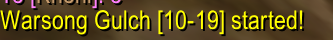

SilentServer
===

Remove Turtle WoW server spam messages like battleground starts or shop advertisement:  

Current version also removes Warlock /yell during raid combat, mainly due to the popularization of hellfire macros.  
To disable this go to `WTF/Account/<accountname>/SavedVariables/SilentServer.lua` and change `["hellfire"] = true` to `["hellfire"] = false`, I'm not going to make a slash command for one variable.  

___
* This addon is made by and for `Weird Vibes` of Turtle WoW.  